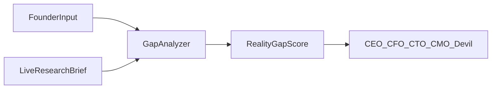
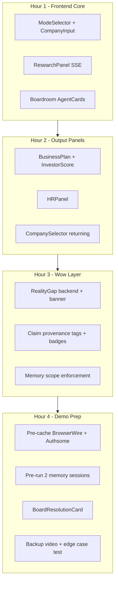

# PitchX: Judge Wow Strategy

Strategic additions to PitchX that maximize judge impact by leaning into what judges actually care about (real data, trust, memory, production edge cases) — prioritized for a team of 2 with backend mostly built and frontend still the demo bottleneck.

---

## What You Already Have (Strong Foundation)

Your backend in [`backend/`](backend/) already implements the core v2 thesis from [`context_new.md`](context_new.md):

- 8-query parallel research ingestion → `CompanyBrief` ([`backend/research_ingestion.py`](backend/research_ingestion.py))
- 3-round adversarial debate with streaming SSE ([`backend/debate_engine.py`](backend/debate_engine.py))
- Structured SQLite memory per company/agent ([`backend/memory_manager.py`](backend/memory_manager.py))
- HR evaluation wired to business plan context ([`backend/debate_engine.py`](backend/debate_engine.py) `HREngine`)
- Devil's Advocate required to cite `CompanyBrief` ([`backend/agents.py`](backend/agents.py))

**The gap is not "more agents" — it's making the system visibly cross the demo-to-production line in the UI and in 2-3 demo moments judges can feel in 3 minutes.**

---

## Judge Psychology Map

| Judge | What makes them lean in | PitchX angle |
|-------|------------------------|--------------|
| **Manoj Bajaj** (Authsome — agent trust infra) | Provable claims, scoped agent actions, auditability | Source provenance + agent memory scope enforcement |
| **Vedanth** (BrowserWire — real web data) | Agents grounded in live fetched data, not prompts | Research panel + Devil quoting real review data |
| **Abhimanyu** (serial founder/operator) | Would he use this on his own company Monday? | Existing Startup Mode + HR tied to plan |
| **Shubham** (systems/quant rigor) | Structured outputs, measurable scores, not chat slop | Dual gauges, board vote, score deltas |

Hackathon theme from [`theme.md`](theme.md) explicitly calls out: **memory, real-world edge cases, safe agent delegation**. Your doc hits memory and research — the wow layer is making **trust + edge cases visible**, not buried in prompts.

---

## The 5 Novel Differentiators (Ranked by Judge Impact)

### 1. Reality Gap Score — "Founder Story vs Live Data" (Highest novelty)

**Problem it solves:** Running startups lie to themselves (politeness bias). Judges will test with their own companies.

**What it is:** After research ingestion, compute a `reality_gap_score` (0-100) by comparing:
- User-provided fields (challenge statement, stage, self-description)
- vs `CompanyBrief` fields (Glassdoor rating, customer complaints, funding, red flags)

**Example output:**
> "You described a strong engineering culture. Glassdoor: 3.2/5. Top employee complaint: 'founder micromanagement'. **Reality Gap: 68/100 (High)**"

**Why judges wow:** No other pitch simulator quantifies **founder delusion vs public reality**. This is visceral when a judge types "BrowserWire" or "Authsome."

**Implementation (backend, ~1 hour):**
- Add `compute_reality_gap(user_input, company_brief)` in [`backend/research_ingestion.py`](backend/research_ingestion.py) or new `reality_gap.py`
- Claude compares two JSON blobs → returns `{score, gaps: [{claim, reality, source}]}`
- Emit SSE event `{type: "reality_gap", score, gaps}` after `brief_ready`
- Frontend: red banner before debate starts — forces agents to argue from the gap



---

### 2. Claim Provenance Layer — "Verified vs Assumption" (Manoj's wow moment)

**Problem:** Agents hallucinate citations. Hackathon theme: "authenticate or act safely on behalf of users."

**What it is:** Require agents to tag claims:
- `[VERIFIED:glassdoor_reviews]` — must match a key in `CompanyBrief`
- `[ASSUMPTION]` — explicitly flagged inference

**Backend (~45 min):**
- Update agent prompts in [`backend/agents.py`](backend/agents.py) to require tags (Devil already partially does this)
- Post-process agent responses in `_run_single_agent` → parse tags → emit `{type: "claim", verified: bool, source_key, text}`
- Attach `research_sources` URLs from brief to each verified claim

**Frontend (~30 min):**
- Inline badges on streamed text: green check = verified, amber = assumption
- Click badge → shows source URL from `CompanyBrief.research_sources`

**Judge line:** *"Every claim is either tied to a live source or explicitly marked as an assumption. We're not hiding uncertainty — we're surfacing it."*

---

### 3. Agent Memory Scopes — Enforced Delegation (Trust infra, 20 lines)

**What it is:** Each agent in `AGENT_CONFIG` already defines `memory_keys`. Enforce at save time in [`backend/debate_engine.py`](backend/debate_engine.py) `_extract_memory_saves`:

```python
allowed = AGENT_CONFIG[agent]["memory_keys"]
if key not in allowed:
    yield {"type": "memory_rejected", "agent": agent, "key": key, "reason": "out_of_scope"}
    continue
```

**Why novel:** Most multi-agent demos let every agent write everything. Scoped memory = **safe delegation model** — directly speaks to Authsome's thesis.

**Demo moment:** Show a rejected save in UI: *"CMO attempted to save financial_model — rejected, CFO scope only."*

---

### 4. Board Resolution Card — Structured Verdict, Not Chat

**What it is:** After Round 3, one synthesis call produces:

```json
{
  "votes": {"CEO": "APPROVE", "CFO": "CONDITIONAL", "CTO": "APPROVE", "CMO": "APPROVE", "Devil": "REJECT"},
  "conditions": ["CFO: Unit economics must hit LTV/CAC > 3 before Series A"],
  "dissent": "Devil: Kill probability 7/10 — competitor funding advantage",
  "board_verdict": "CONDITIONAL_GO"
}
```

**Why judges wow:** Shubham and Abhimanyu see **decision infrastructure**, not a chatbot. Pairs naturally with existing `investor_readiness_score`.

**Implementation:** Extend `_synthesize_plan` or add `_synthesize_board_vote` (~30 min backend). Frontend card with vote chips (~20 min).

---

### 5. Two-Session Memory Theater — Pre-baked + Live

**The single best memory demo** (already in your doc, needs execution discipline):

**Before judging (4:30 PM):**
1. Run full session for "BrowserWire" (Vedanth's company) — let agents save memories
2. Run a second quick session for "Authsome" (Manoj's company)

**Live demo (5:30 PM):**
1. Select returning "BrowserWire" from company list
2. CEO opens with: *"As we established in our previous session, our moat is..."*
3. Show Memory Timeline with badges: `CEO: established_vision`, `CFO: financial_model_v1`

**Add Memory Diff (stretch, high wow):**
- Compare `agent_memories` between session N and N+1
- Show: *"CFO changed position: burn rate 40% higher than model v1 — reason: new competitor funding"*
- Backend: `GET /api/company/{id}/memory/diff?from_session=X&to_session=Y`

This is more impressive than any new agent because it proves **longitudinal agent behavior** — the hackathon's #1 stated pain point.

---

## Demo Choreography (No Code, High ROI)

### The 3-Minute Script (optimized for judges)

| Time | Moment | What judges see |
|------|--------|-----------------|
| 0:00-0:30 | Type **BrowserWire** → research fires | 8 live queries completing (not fake loading) |
| 0:30-0:45 | **Reality Gap banner** appears | "Public data contradicts 2 founder claims" |
| 0:45-1:45 | Debate stream | Devil quotes Glassdoor with `[VERIFIED]` badge |
| 1:45-2:00 | Load **returning BrowserWire** | Memory badges + CEO references past session |
| 2:00-2:45 | HR panel | "Per CTO Round 2: needs Kubernetes" in candidate eval |
| 2:45-3:00 | Board Resolution + dual gauges | Investor Score 67, Kill Probability 4/10 |

### Pre-cache insurance (mandatory)
Store JSON briefs for BrowserWire + Authsome in `backend/demo_cache/` — if Tavily is slow at demo time, fall back instantly with a visible "cached research" indicator (honesty > fake live data).

### Edge-case theater (30 seconds, huge credibility)
Deliberately demo an obscure company name with no public data:
> "Limited public data — proceeding with founder context. All claims marked ASSUMPTION."

This directly answers the hackathon thesis: **agents that don't break off the golden path.**

---

## Frontend Priority (Demo Bottleneck)

No `frontend/` exists yet. Build only what serves the wow moments:

**P0 (must ship):**
- `ModeSelector` + `CompanyInput` with URL
- `ResearchPanel` — live query checklist (SSE from `/api/research/ingest`)
- `Boardroom` — streaming `AgentCard` with agent colors from SSE metadata
- `InvestorScore` gauge + **Kill Probability** gauge (from Devil)
- `BusinessPlan` renderer (5 sections from `business_plan` event)
- Returning company selector (`GET /api/companies`)

**P1 (wow layer):**
- `RealityGapBanner`
- Claim provenance badges on agent text
- `BoardResolutionCard`
- `MemoryTimeline` with save/reject notifications
- `HRPanel` with candidate score bars

**Skip for today:** PDF upload, industry presets, ZIP export, shareable URLs

---

## What NOT to Build (Commodity / Low ROI)

| Idea | Why skip |
|------|----------|
| More agents (Legal, Compliance) | Dilutes story; 6 is already complex |
| `financial_calc` tool | Prompt-based CFO tables are enough for demo; tool-calling adds latency |
| MCP server / "Building for Agents" API | Cool but invisible in 3-min demo |
| Real-time multi-user boardroom | Not novel, not demoable |
| LinkedIn auto-import | Integration rabbit hole |

---

## Judging Criteria Alignment After Additions

| Criterion | Before | After these additions |
|-----------|--------|----------------------|
| **Innovation** | Research + memory + HR pipeline | + Reality Gap + provenance + scoped memory |
| **Technical Complexity** | SSE, SQLite, parallel research | + claim parsing, scope enforcement, board synthesis |
| **Impact** | Founders + running startups | + quantified self-deception audit operators actually need |
| **Presentation** | Good if frontend ships | + dual gauges, verified badges, 2-session memory theater |

---

## Recommended Build Order (Remaining Time)



**If time runs out:** Cut Board Resolution and Memory Diff before cutting Reality Gap, provenance badges, or pre-cached judge-company demos.

---

## Killer One-Liners for Q&A

- **Manoj:** *"Agents can only write to their scoped memory keys — same principle as least-privilege auth for autonomous systems."*
- **Vedanth:** *"Devil's Advocate quoted a real Glassdoor review — click the verified badge, here's the source URL."*
- **Abhimanyu:** *"This isn't a pitch coach. It's the board meeting your real board is too polite to have."*
- **Shubham:** *"Investor readiness is 67, kill probability is 4/10, board vote is conditional — all structured, all auditable."*

---

## Todos

- [ ] **reality-gap** — Add Reality Gap Score: compare user input vs CompanyBrief, emit SSE event + frontend banner
- [ ] **claim-provenance** — Enforce [VERIFIED]/[ASSUMPTION] tags in agent prompts; parse and render provenance badges in UI
- [ ] **memory-scopes** — Enforce agent memory_keys at save time; emit memory_rejected events for out-of-scope writes
- [ ] **frontend-core** — Build P0 frontend: ModeSelector, ResearchPanel SSE, Boardroom AgentCards, BusinessPlan, gauges, company selector
- [ ] **board-resolution** — Add structured board vote synthesis (APPROVE/CONDITIONAL/REJECT) after Round 3
- [ ] **demo-prep** — Pre-cache BrowserWire/Authsome briefs, pre-run 2 memory sessions, rehearse 3-min script + edge-case fallback